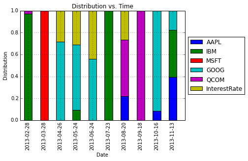
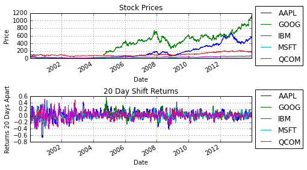
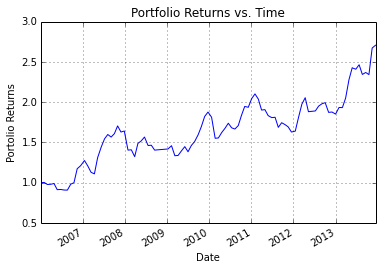

## Main Idea

In the [previous post] (  ), I was trying to solve the Markowitz portfolio optimization problem under the no shorts constraint:

\\begin{align}
&\\underset{\\mathbf{x}}{\\mbox{minimize}} & & \\mathbf{x}^{T} \\Sigma \\mathbf{x} \\\\
& \\mbox{subject to} & & \\bar{\\mathbf{p}}^{T} \\mathbf{x} \\geq r_{\\min} \\\\
& & &\\mathbf{1}^{T} \\mathbf{x} = 1 \\\\
& & &\\mathbf{x} \\geq 0
\\end{align}

where $\mathbf{x}$ is the $n$-dimensional vector given our positions in $n$ assests, $\bar{\mathbf{p}}$ is the vector of mean returns for the $n$ assets and $\Sigma$ is the covariance matrix for the $n$ assets. In this post, I am going to flip the role of the objective function and the mean return constraint in the above optimization problem, i.e. I want to maximize the mean return under a variance constraint. The new optimization problem is

\\begin{align}
&\\underset{\\mathbf{x}}{\\mbox{minimize}} & & \\bar{\\mathbf{p}}^{T} \\mathbf{x} \\\\
& \\mbox{subject to} & & \\mathbf{x}^{T} \\Sigma \\mathbf{x} \\leq \\sigma_{\\max} \\\\
& & &\\mathbf{1}^{T} \\mathbf{x} = 1 \\\\
& & &\\mathbf{x} \\geq 0
\\end{align}

where $\sigma_{max}$ is the maximum variance constraint. The original Markowitz optimization problem was a quadratic program (QP), where as the new optimization problem is a quadratically constrained quadratic program (QCQP). QP is a subclass of QCQP, so as one would imagine, it is more difficult to solve QCQP, but luckily [CVXOPT](http://cvxopt.org/) is up to the task after we convert the QCQP into an even more general class of optimization problems - second-order cone programs (SOCP). 
<!-- PELICAN_END_SUMMARY -->

## QCQPs to SOCPs

CVXOPT does not have an explicit solver for QCQPs, rather we must convert the QCQP to a SOCP, or one could also convert it to a semidefinite program (SDP), which is more general than a SOCP. Note that if one is using MATLAB, there are many useful parsers that will directly solve the QCQP by doing the conversion to SOCPs or SDPs behind the scenes. Such parsers include [CVX](http://cvxr.com/cvx/) and [YALMIP](http://users.isy.liu.se/johanl/yalmip/). Unfortunely, using python, our options are currently limited (to my knowledge), so we must make do with using CVXOPT and doing the conversion ourselves without the aid of a parser. The general form of a SOCP, as given in [Boyd and Vandenberghe](https://web.stanford.edu/~boyd/cvxbook/bv_cvxbook.pdf), is

\\begin{align}
&\\underset{\\mathbf{x}}{\\mbox{minimize}} & & \\mathbf{f}^{T} \\mathbf{x} \\\\
& \\mbox{subject to} & & \\Vert A\_{i} \\mathbf{x} + \\mathbf{b}\_{i} \\Vert\_{2} \\leq \\mathbf{c}\_{i}^{T} \mathbf{x} + d\_{i} \\\\
& & & F \\mathbf{x} = \\mathbf{g} \\\\
\\end{align}

This may not immediately look like the optimization problem that we want to solve, but the conversion is straight forward. Handling the variance constraint first for $i=1$, let $A = \Sigma^{\frac{1}{2}}$, $\mathbf{b}\_{1} = 0$, $\mathbf{c}\_{1} = 0$ and $d\_{i} = \sqrt{\sigma\_{max}}$. Next, let us handle the equality constraints $F\mathbf{x} = \mathbf{g}$. The only equality constraint we need is $\mathbf{1}^{T}\mathbf{x} = 1$, thus we set $\mathbf{F} = \mathbf{1}^{T}$ and $\mathbf{g} = 1$. Let $n$ be the number of assets, then we will need another $n$ inequality constraints of the form $\Vert A\_{i} \mathbf{x} + \mathbf{b}\_{i} \Vert_{2} \leq \mathbf{c}\_{i}^{T} \mathbf{x} + d\_{i}$ for $i = 2,\ldots,n+1$ to capture the constraint $\mathbf{x} \geq 0$. Namely, for $i = 2,\ldots,n+1$, let $A\_{i} = 0$, $\mathbf{b}\_{i} = 0$, $d\_{i} = 0$ and $\mathbf{c}\_{i} = \mathbf{e}\_{i}$ where $\mathbf{e}\_{i-1}$ is the $\mathbf{e}\_{j}$ is the $j^{th}$ canonical basis vector.

Unfortunately, we are not finished yet, because CVXOPT requires a specific format as specified in its [documentation](http://cvxopt.org/userguide/coneprog.html#second-order-cone-programming). The conversion from the above SOCP to the CVXOPT required format is described [here](http://pwnetics.wordpress.com/2010/12/18/second-order-cone-programming-with-cvxopt/). Following their procedure yields the following set of matrices as inputs into CVXOPT:

\\begin{align}
& G\_{1} = \\left [ \\begin{array}{c} 0 \\\\ -\\Sigma^{\\frac{1}{2}} \\end{array} \\right ] & \\mbox{ and } & \\mathbf{h}\_{1} = \\left [ \\begin{array}{c} \\sqrt{\\sigma\_{max}} \\\\ \\mathbf{0} \\end{array} \\right ] \\\\
& G\_{i} = \\left [ -\\mathbf{e}\_{i}^{T} \\right ] & \\mbox{ and } & \\mathbf{h}\_{i} = \\left [ 0 \\right ] & \\mbox{ for } i = 2,\\ldots,n+1 
\\end{align}

with the additional equality constraints described above. When implementing the prior SOCP, errors were encountered because apparently the method to generate the covariance matrix does not guarantee a positive semi-definite $\Sigma$, which is required of a QCQP or SOCP. Because this is more an exercise in implementing ideas in python than to implementing perfect algorithms, I just made a quick fix: I project the $\Sigma$ matrix onto the positive semi-definite cone by making all the negative eigenvalues in $\Sigma$ equal to 0 (aside: in retrospect, this should be done in the [previous post] (  ) as well). Thus the final implementation of the SOCP for this problem is the following additional method to my MarkowitzOpt class:


```python
def FlipConstraintMarkowitzOpt(meanvec,varvec,covvec,irate,varmax):
	'''Solve QCQP by converting to SOCP
	Format from:
	http://cvxopt.org/userguide/coneprog.html#second-order-cone-programming'''

	# Generate mean return vector
	pbar = np.append(meanvec.values,irate)
	# Get Values from varvec and covvec
	varvec = varvec.values
	covvec = covvec.values

	# Generate covariance matrix
	counter = 0
	numPOS = pbar.size
	SIGMA = np.zeros((numPOS,numPOS))
	for i in np.arange(numPOS-1):
		for j in np.arange(i,numPOS-1):
			if i == j:
				SIGMA[i,j] = varvec[i]
			else:
				SIGMA[i,j] = covvec[counter]
				SIGMA[j,i] = SIGMA[i,j]
				counter+=1

	# Compute A matrix in optimization
	# A is the square root of SIGMA
	U,V = np.linalg.eig(SIGMA)
	# Project onto PSD
	U[U<0] = 0
	Usqrt = np.sqrt(U)
	A = np.dot(np.diag(Usqrt),V.T)

	# Generate G and h matrices
	G1temp = np.zeros((A.shape[0]+1,A.shape[1]))
	G1temp[1:,:] = -A
	h1temp = np.zeros((A.shape[0]+1,1))
	h1temp[0] = np.sqrt(varmax)	

	for i in np.arange(numPOS):
		ei = np.zeros((1,numPOS))
		ei[0,i] = 1
		if i == 0:
			G2temp = [matrix(-ei)]
			h2temp = [matrix(np.zeros((1,1)))]
		else:
			G2temp += [matrix(-ei)]
			h2temp += [matrix(np.zeros((1,1)))]

	# Construct list of matrices
	Ftemp = np.ones((1,numPOS))
	F = matrix(Ftemp)
	g = matrix(np.ones((1,1)))

	G = [matrix(G1temp)] + G2temp
	H = [matrix(h1temp)] + h2temp

	# Solve QCQP
	# solvers.options['show_progress'] = False
	# Passing in -matrix(pbar) since maximizing
	sol = solvers.socp(-matrix(pbar),Gq=G,hq=H,A=F,b=g)
	xsol = np.array(sol['x'])
	# return answer
	return xsol
```

## Results

Running the same script as in the [previous post] (  ) except for calling the new method FlipConstraintMarkowitzOpt and using a maximum variance parameter of $\sigma_{max} = 0.001$ yields the following figures:










The interesting thing about this project is to see how the algorithm distributes the proportion of money across assets. As with the previous project, I want to reiterate that this is not meant as an investigation into legitimate trading procedure. For comparison, below is the distribution using Markowitz portolio optimization from the previous post.


