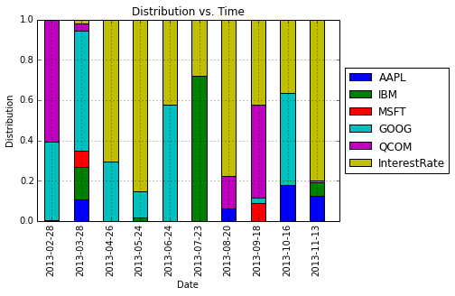
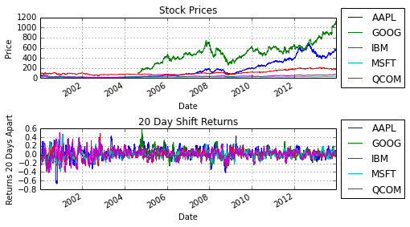
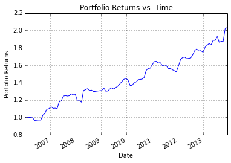

## Overview

Markowitz portfolio optimization is a technique that gives the optimal position in a set of investiments to minimize risk with a minimum expected return constraint. This idea is by no means new, as Markowitz introduced the idea in 1952 and was awarded the Nobel prize in 1990 for his work on [modern portfolio theory](http://en.wikipedia.org/wiki/Modern_portfolio_theory). Markowitz portfolio optimization requires that some statistics about the assests are known: the mean returns and covariance among the assests. It is unclear how to optimally estimate these parameters. When taking the [coursera.org](https://www.coursera.org/) course on financial engineering from Columbia, there was a lecture on Markowitz portfolio optimization as well as a homework exercise, but these parameters were given. This positing is not about surveying different estimation techniques, nor proposing any new ones, but is rather an excuse for me to try to improve my python skills. 
<!-- PELICAN_END_SUMMARY -->

## Gathering The Data

The first step is to get data on our assets. Here, I will be focusing on stocks. To keep things simple, I just selected five stocks: Apple, IBM, Google, Microsoft and Qualcomm. I will also consider a fixed interest rate position with zero risk. The pandas library provides an easy way to get all the stock prices at the close of every business day. The following code will produce a pandas Dataframe object with the daily adjusting closing price of the five stocks from January 1st, 2000 to January 1st, 2014. Since Google was not a publicly traded company during the beginning of this time frame, NaN are filled in. The list comprehension expression to get the data was taken from the book [**Python for Data Analysis**](http://www.amazon.com/Python-Data-Analysis-Wrangling-IPython/dp/1449319793) by Wes McKinney. 


```python
import pandas as pd
import numpy as np
import pandas.io.data as web
from pandas import Series, DataFrame

StockList = ['AAPL','IBM','MSFT','GOOG','QCOM']
all_data = {}
# For simplicity, assume fixed interest rate
interest_rate = 0.03/12.
# Minimum desired return
rmin = 0.02
for ticker in StockList:
    all_data[ticker] = web.get_data_yahoo(ticker,'1/1/2000','1/1/2014')
    price = DataFrame({tic: data['Adj Close'] for tic, 
                       data in all_data.iteritems()})
```


```python
print price.head(10)
```

                 AAPL  GOOG    IBM   MSFT   QCOM
    Date                                        
    2000-01-03  26.90   NaN  96.60  42.59  77.19
    2000-01-04  24.63   NaN  93.32  41.15  69.77
    2000-01-05  24.99   NaN  96.60  41.58  67.35
    2000-01-06  22.83   NaN  94.93  40.19  60.30
    2000-01-07  23.91   NaN  94.52  40.72  64.57
    2000-01-10  23.49   NaN  98.26  41.01  68.61
    2000-01-11  22.29   NaN  99.10  39.96  62.18
    2000-01-12  20.95   NaN  99.51  38.66  59.52
    2000-01-13  23.25   NaN  98.47  39.39  61.62
    2000-01-14  24.13   NaN  99.61  41.01  60.46
    
    [10 rows x 5 columns]


## Estimating The Parameters

Now that we have the stock data we need to figure out how to compute the required parameters for the Markowitz portfolio optimization: the mean returns and covariance. I also need to pick a time frame to compute these parameters over. In this case, I choose 20 business days. Thus, the first step is to compute the returns 20 days into the future:


```python
# Specify number of days to shift
shift = 20
# Compute returns over the time period specified by shift
shift_returns = price/price.shift(shift) - 1
```

We could also have used the pandas Dataframe method pct_change with the period set to 20. Now that we have the returns over the period we want, we can compute the mean and covariance. As stated before, the purpose of this exercise is more for me to improve at python and not particularly to do anything advanced, so I opted to use a exponential weighting or an AR-1 model:


```python
# Specify filter "length"
filter_len = shift
shift_returns_mean = pd.ewma(shift_returns,span=filter_len)
shift_returns_var = pd.ewmvar(shift_returns,span=filter_len)
# Compute covariances
NumStocks = len(StockList)
CovSeq = pd.DataFrame()
for FirstStock in np.arange(NumStocks-1):
	for SecondStock in np.arange(FirstStock+1,NumStocks):
		ColumnTitle = StockList[FirstStock] + '-' + StockList[SecondStock]
		CovSeq[ColumnTitle] = pd.ewmcov(
                                    shift_returns[StockList[FirstStock]],
                                    shift_returns[StockList[SecondStock]],
                                    span=filter_len)
```

To reiterate, I am not claiming this is the best way of estimating the parameters. 

## Computing The Markowitz Optimal Portfolio

Now that we have the parameters we need, all that is left to do is to compute the optimal Markowitz portfolio. Let $\mathbf{x}$ be the vector describing the proportion of money to put into each assest, $\bar{\mathbf{p}}$ be the vector of mean returns, $\Sigma$ be the covariance matrix and $r_{\min}$ be the minimum expected return that is desired. Having defined those variables, the optimal Markowitz portfolio assuming no short positions is given by the following quadratic program (see [Boyd and Vandenberghe](http://www.amazon.com/Convex-Optimization-Stephen-Boyd/dp/0521833787/ref=sr_1_1?ie=UTF8&qid=1394388548&sr=8-1&keywords=convex+optimization)) 
\\begin{align}
&\\underset{\\mathbf{x}}{\\mbox{minimize}} & & \\mathbf{x}^{T} \\Sigma \\mathbf{x} \\\\
& \\mbox{subject to} & & \\bar{\\mathbf{p}}^{T} \\mathbf{x} \\geq r_{\\min} \\\\
& & &\\mathbf{1}^{T} \\mathbf{x} = 1 \\\\
& & &\\mathbf{x} \\geq 0
\\end{align}
In order to solve this problem, I downloaded the python convex optimization package [CVXOPT](http://cvxopt.org/) and then wrote the following class and method:


```python
from cvxopt import matrix, solvers
import numpy as np

def MarkowitzOpt(meanvec,varvec,covvec,irate,rmin):
	'''Framework and variable names taken from pg.155 of Boyd and Vandenberghe
	CVXOPT setup taken from:
	http://cvxopt.org/userguide/coneprog.html#quadratic-programming
	http://cvxopt.org/userguide/coneprog.html#quadratic-programming'''

	# Number of positions
	# Additional position for interest rate
	numPOS = meanvec.size+1
	# Number of stocks
	NumStocks = meanvec.size
	# mean return vector
	pbar = matrix(irate,(1,numPOS))
	pbar[:numPOS-1]=matrix(meanvec)

	# Ensure feasability Code
	pbar2 = np.array(pbar)
	if(pbar2.max() < rmin):
		rmin_constraint = irate
	else:
		rmin_constraint = rmin;

	counter = 0
	SIGMA = matrix(0.0,(numPOS,numPOS))
	for i in np.arange(NumStocks):
		for j in np.arange(i,NumStocks):
			if i == j:
				SIGMA[i,j] = varvec[i]
			else:
				SIGMA[i,j] = covvec[counter]
				SIGMA[j,i] = SIGMA[i,j]
				counter+=1

	# Generate G matrix and h vector for inequality constraints
	G = matrix(0.0,(numPOS+1,numPOS))
	h = matrix(0.0,(numPOS+1,1))
	h[-1] = -rmin_constraint
	for i in np.arange(numPOS):
		G[i,i] = -1
	G[-1,:] = -pbar
	# Generate p matrix and b vector for equality constraints
	p = matrix(1.0,(1,numPOS))
	b = matrix(1.0)
	q = matrix(0.0,(numPOS,1))
	# Run convex optimization program
	solvers.options['show_progress'] = False
	sol=solvers.qp(SIGMA,q,G,h,p,b)
	# Solution
	xsol = np.array(sol['x'])
	dist_sum = xsol.sum()

	return xsol
```

The input variable irate describes the interest rate which is assumed fixed during the duration of the optimizaton period (defined in this example above as 20 business days, however for simplicity I will assume it is fixed for all time). The interest rate is assumed to be a risk free position. The first part of the code creates a new mean vector with the interest rate return appended (note I assumed this value is the expected return for the duration of the optimization but it may be adjusted to account for this period, i.e. the return from interest over an arbitrary duration of time). The next part of the code converts the covariance matrix into the matrix structure required of CVXOPT. Then the quadratic program is put into the cannonical form required of CVXOPT and lastly the optimal position is computed and returned. 

## Putting It All Together

Now that the hard work is done, all that is left to do is actually compute the Markowitz optimal portfolio. I will start optimizing on January 3rd, 2006 (not at the beginning of our data set to allow some time for the means and covariance to stabilize a little), the the portfolio will be reoptimized every 20 business days. 


```python
# Variable Initialization
START_DATE = '2006-01-03'
INDEX = shift_returns.index
START_INDEX = INDEX.get_loc(START_DATE)
END_DATE = INDEX[-1]
END_INDEX = INDEX.get_loc(END_DATE)
DATE_INDEX_iter = START_INDEX
StockList.append('InterestRate')
DISTRIBUTION = DataFrame(index=StockList)
RETURNS = Series(index=INDEX)
# Start Value
TOTAL_VALUE = 1.0
RETURNS[INDEX[DATE_INDEX_iter]] = TOTAL_VALUE

while DATE_INDEX_iter + 20 < END_INDEX:
	DATEiter = INDEX[DATE_INDEX_iter]
	# print DATEiter

	xsol = MarkowitzOpt(shift_returns_mean.ix[DATEiter],
                        shift_returns_var.ix[DATEiter],
                        CovSeq.ix[DATEiter],interest_rate,rmin)

	dist_sum = xsol.sum()
	DISTRIBUTION[DATEiter.strftime('%Y-%m-%d')] = xsol

	DATEiter2 = INDEX[DATE_INDEX_iter+shift]
	temp1 = price.ix[DATEiter2]/price.ix[DATEiter]
	temp1.ix[StockList[-1]] = interest_rate+1
	temp2 = Series(xsol.ravel(),index=StockList)
	TOTAL_VALUE = np.sum(TOTAL_VALUE*temp2*temp1)
	# print TOTAL_VALUE

	# Increase Date
	DATE_INDEX_iter += shift
# 	print 'Date:' + str(INDEX[DATE_INDEX_iter])
	RETURNS[INDEX[DATE_INDEX_iter]] = TOTAL_VALUE

# Remove dates that there are no trades from returns
RETURNS = RETURNS[np.isfinite(RETURNS)]
```

Lastly, let us plot our results.


```python
import matplotlib.pyplot as plt
%matplotlib inline

temp3 = DISTRIBUTION.T
# To prevent cramped figure, only plotting last 10 periods
ax = temp3.ix[-10:].plot(kind='bar',stacked=True)
plt.ylim([0,1])
plt.xlabel('Date')
plt.ylabel('Distribution')
plt.title('Distribution vs. Time')
ax.legend(loc='center left', bbox_to_anchor=(1, 0.5))


fig, axes = plt.subplots(nrows=2,ncols=1)
price.plot(ax=axes[0])
shift_returns.plot(ax=axes[1])
axes[0].set_title('Stock Prices')
axes[0].set_xlabel('Date')
axes[0].set_ylabel('Price')
axes[0].legend(loc='center left', bbox_to_anchor=(1, 0.5))
axes[1].set_title(str(shift)+ ' Day Shift Returns')
axes[1].set_xlabel('Date')
axes[1].set_ylabel('Returns ' + str(shift) + ' Days Apart')
axes[1].legend(loc='center left', bbox_to_anchor=(1, 0.5))
fig.tight_layout()

plt.figure()
RETURNS.plot()
plt.xlabel('Date')
plt.ylabel('Portolio Returns')
plt.title('Portfolio Returns vs. Time')

plt.show()
```











This last plot shows us that using a our approach yielded a portfolio that increased 203%. This is obviously not to be taken too seriously as we know these stocks have done well over the past decade (surivivor bias). 
