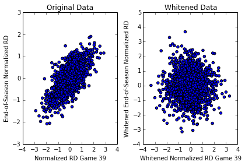

## Everyone's Talking About Run Differential

So it's been a long time since I've attempted a blog post. My friend and co-worker [EBHI](http://www.sbnation.com/users/JerryBrewerEBHI) is a moderator at the awesome A's blog [Athletic's Nation](http://www.athleticsnation.com/). Growing up and now working in the East Bay, I've always been an A's fan and so I thought it might be fun to do some baseball analysis. This season the A's are doing great, and I've been reading a great deal about run differential. The first article chronologically I saw regarding run differential and the A's was on [Baseball Prospectus](http://www.baseballprospectus.com/article.php?articleid=23497). Then [mlb.com](http://mlb.mlb.com/news/article/mlb/oakland-as-are-outscoring-their-opponents-at-otherworldly-rate?ymd=20140611&content_id=79301054&vkey=news_mlb) had an article regarding the A's and run differential, and most recently, two eerily similar articles were posted within a day of each [here](http://www.athleticsnation.com/2014/6/25/5843998/so-the-as-are-really-good-maybe-even-historically-good) and [here](http://grantland.com/the-triangle/the-historically-dominant-oakland-as/). I originally had some grand aspirations to use some fancy correlation metrics, but that will have to wait for a possible future post. In fact the analysis in this article is pretty elementary, but it does provide good python practice for me. In this analysis I will only be focusing on classical correlation coefficients.
<!-- PELICAN_END_SUMMARY -->

## Correlating Run Differential with Various Things

The first thing I wanted to do was reproduce the same figure found in the [Baseball Prospectus](http://www.baseballprospectus.com/article.php?articleid=23497) article. In order to do that I needed to download the data for all games from the 1962 to 2013 seasons and parse them to compute the game-by-game run differential. I download the data from [here](http://www.retrosheet.org/). The run differential is normalized by the game number (e.g. the run differential after game 81 is divded by 81). Here's the really simple code I used to get the files:


```python
import urllib

base_url = 'http://www.retrosheet.org/gamelogs/'

for year in range(1962,2014):
	url = base_url + 'gl' + str(year) + '.zip'
    #Change Directory Accordingly
    directory = ''
	filename = directory + 'gl' + str(year) + '.zip'
	testfile=urllib.URLopener()
	testfile.retrieve(url,filename)
```

With all the data downloaded and processed, I was able to reproduce the figure:


Comparing this to the [Baseball Prospectus](http://www.baseballprospectus.com/article.php?articleid=23497) article, we see that they are visually identical. The analysis from the article uses a correlation value of 0.7 as being significant, and this threshold is exceeded at the 39th game. I will provide further analysis later in this article. Next I wanted to compute the correlation between normalized run differential and end-of-season winning percentage. I also included the above plot of the correlation between the game-by-game normalized run differential and end-of-season run differential. Because it's easy enough to include, I also plotted the game-by-game winning percentage correlated with end-of-season winning percentage. Below is the correlation plot:


The above plot shows that the correlation trends are very similar, but normalized run differential is less correlated with end-of-season winning percentage (red curve) than end-of-season normalized run differential (the blue curve, which seems expected). The black curve is the game-by-game winning percentage correlated with end-of-season winning percentage. Next I wanted to see if game-by-game run differential or game-by-game winning percentage correlated with the end-of-season rank. Below is the corresponding plot:


The above plot shows that both normalized run differential and winning percentage do not correlate with end-of-season rankings. The main take away thus far seems to be the following:

- game-by-game normalized run differential correlates well with end-of-season run differential after a sufficient number of games
- game-by-game winning percentage correlates well with end-of-season winning percentage after a sufficient number of games
- game-by-game normalized run differential correlates well with end-of-season winning percentage after a sufficient number of games
- game-by-game normalized run differential **_does not_** correlate with end-of-season rank
- game-by-game winning percentage **_does not_** correlate with end-of-season rank

## Gaussian Analysis of Normalized Run Differential

Just because two features appear correlated does not necessarily tell us much about the relationship between the two features. In this section I will look at the normalized run differential data and see if it appears gaussian. Below is the scatter plot of the normalized run-differential at the 39th game (the game mentioned in the [Baseball Prospectus](http://www.baseballprospectus.com/article.php?articleid=23497) article where the correlation exceeds 0.7) as well as the whitened version of the data:




The plot on the left is the scatter plot of end-of-season normalized run differential versus normalized run differential for game 39 in the season. It looks like it could be a multivariate gaussian. I whitened the data and the scatter plot is on the right. It should appear "spherical" after the whitening and it is hard to tell but seems like it could be. Below are the marginal histograms of the normalized run differential after game 39 and the fitted normal distribution and the histogram of the end-of-season normalized run differential and fitted histogram: 


Running a normality test on the marginals, the p-value for the x-axis marginal is 0.55 and the p-value for the y-axis marginal is 0.008. The null hypothesis is that the data is normal, and we would reject the null hypothesis at a p-value less than 0.05 typically. Thus it seems unlikely that the y-axis data (end-of-seasson normalized run differential) is normally distributed. Below are the Q-Q plots:


The above Q-Q plots seem confirm the results of the hypothesis tests: the marginal x distribution appears pretty normal but the marginal y distribution seems skewed. For fun, below are the marginal histograms, fitted normals and Q-Q plots of the whitened data:


The p-values for the marginal distribution normality tests after whitening are 0.55 and 0.61. Thus the rotated data "appears" more normal than the original data. The Q-Q plots also seem to indicate this. There do exist hypothesis tests for multivariate normality, but I've been lazy and did not implement them. If the data were truly bivariate normal, the data should appear guassian before and after the whitening process. Because it is the marginal y-axis distribution, which is the marginal distribution of the end-of-season normalized run differential, is the one that does not appear gaussian, none of the games can be jointly normal. Because of this, we should be careful is our intepretation of the correlation coefficient. The correlation coefficient measures linear relationships between two random variables, and is equal to the correlation coefficient of a bivariate normal when the data is jointly normal. Because it does not appear that the data is jointly normal, the correlation coefficient cannot be interpreted as the correlation coefficient of a bivariate normal. 

We can repeat this experiment with the correlation between normalized run differential after 39 games and end-of-season winning percentage. The results are similar. Below are the scatter plots, marginal histograms and Q-Q plots:


The p-values for the hypothesis test are 0.55 and 0.0008. The p-value for the marginal x-distribution should be the same as before as it's the same random variable. The p-value of the marginal end-of-season winning percentage seems very unlikely to be drawn from a Gaussian distribution, and thus joint will not be Gaussian. 

To conclude this analysis, the correlation between normalized run differential for each game and either end-of-season normalized run differential or end-of-season winning percentage definitely seems to exists, but the relationship is more complicated as it does not appear that the data is normal. Future analysis would be required to determine or model the nature of this relationship.
