## More On Run Differential

In the [previous post] (  ) post, I looked at run differential from a correlation point of view. The correlation analysis is not very predictive however, unless we want to assume there is a linear relationship between normalized run differential and end-of-season run differential (which there could be, but the analysis seems to suggest the joint distribution is not Gaussian in which case the correlation is difficult to interpret). In this post, I'll take a Bayesian approach to run differential that will be more predictive in nature. Namely, I will assume that the per game run differential (not normalized) is a discrete random variable. I will use the historical data on run differential to generate a prior and then use the games played by the A's this season to estimate the probabilities of the discrete random variable. With those parameters estimated, I can compute the distribution of run differential at the end of the season. Additionally, it is straight forward to convert the multinomial run differential distribution into a binomial win distribution. In this way, I will also compute the distribution of the number of wins at the of the season.
<!-- PELICAN_END_SUMMARY -->

## Prior Run Differential Distribution

From the run differential data parsed in the [previous post] (  ), it is straight forward to compute the run differential distribution from all the games from 1962 to 2013. Below is the distribution:

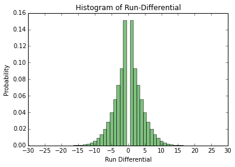

As is expected, the run differential is symmetric since when a team wins by, say, x runs, another team loses by x runs. I will model the run differential as a discrete random variable, i.e. let $X_{i} \in \{-30,\ldots,30\}$ be the run differential random variable for game $i$ and all the games will be i.i.d. realizations from this distribution. The range from -30 to 30 was chosen arbitrarily but covers all observed run differentials from 1962 onward. I will try to estimate the probabilities for each run differential value for the 2014 A's. To do this, I will take a Bayesian approach and put a prior probability on the probabilities. Because the parameters are probabilities, we need a prior distribution on discrete probability distributions. Luckily, the [Dirichlet distribution](http://en.wikipedia.org/wiki/Dirichlet_distribution) is exactly what is needed. Because the run differential random variable $X_{i}$ has support on $\{-30,\ldots,30\}$, there are 61 hyperparameters for the Dirichlet distribution. I want the expectation of the Dirichlet prior distribution to be equal to the historical run differential distribution in the figure above, thus the hyperparameters are proportional to the probabilities in the above graph. I will play around with the proportionality constant later.

## Bayesian Run Differential Analysis

As stated earlier, I will model the run differential as a discrete random variable with parameters $\{\theta\_{-30},\ldots,\theta\_{30}\}$ (the probabilities for each run differential value) and a prior distribution on $\mathbf{\theta}$ (the vector of $\theta$ values) which is a Dirichlet distribution with hyperparameter $\alpha$ (the vector of $\alpha$ values). Let $\mathcal{D}\_{n}$ be the observed run differential for the 2014 A's through $n$ games. Thus, for estimating the $\{\theta\_{i}\}$, we have the posterior distribution $p(\theta \vert \mathcal{D}\_{n})$, which by Bayes theorem is proportional to $p(\mathcal{D}\_{n} \vert \theta) p(\theta \vert \alpha)$ where the likelihood $p(\mathcal{D}\_{n} \vert \theta)$ is a [multinomial distribution](http://en.wikipedia.org/wiki/Multinomial_distribution) and the prior $p(\theta \vert \alpha)$ is the aforementioned Dirichlet distribution. The posterior in this case is well known (for example see [Machine Learning: A Probabilistic Perspective](http://mitpress.mit.edu/books/machine-learning-2) Chapter 3); it is another Dirichlet distribution with parameters $\{ \tilde{\alpha}\_{-30},\ldots, \tilde{\alpha}\_{30}\} = \{\alpha\_{-30} + N\_{-30},\ldots,\alpha\_{30} + N\_{30}\}$ where $N\_{i}$ is the number of times run differential $i$ is observed in $\mathcal{D}\_{n}$. Now that we know the posterior distribution $p(\theta \vert \mathcal{D}\_{n})$ is a Dirichlet distribution, we can compute the predictive posterior distribution $p(X = i \vert \mathcal{D}) = \int p(X = i \vert \theta) p(\theta \vert \mathcal{D}\_{n}) d \theta$, i.e. the probability that the run differential takes on value $i$ given the data marginalizing over the parameters. It turns out that because the posterior $p(\theta \vert \mathcal{D}\_{n})$ is Dirichlet and that we model $p(X = j \vert \theta) = \theta\_{j}$, the previous integral has a well known solution (again see Chapter 3 of Machine Learning: A Probabilistic Perspective):

\\begin{align}
p(X = i \\vert \\mathcal{D}) = \\frac{\\alpha_j + N_j}{\\sum (\\alpha_i + N_i)}
\\end{align}

Thus, given the A's run differential through $n$ games, $\mathcal{D}\_n$, we can compute the probability that the A's have run differential $j$ in a game: $p(X = j \vert \mathcal{D}\_{n})$. Note this is the probability given our model and we only hope that the model is close to reality. 

### Unweighted $\alpha$

Previously, it was mentioned that in order for the Dirichlet prior to have expectation equal to the historical data, the $\{\alpha\_{i}\}$ must be proportional to the the historical run differential probabilities. In this section we will assume the $\{\alpha\_{i}\}$ are equal to those probabilities, i.e. the proportionality constant is 1. Since we know $p(X = i \vert \mathcal{D})$ from the above analysis, we can compute the run differential for the entire season by drawing random variables from that distribution. For example, using the 39 game threshold from the previous post, we can draw $162-39=123$ random variables from this distribution to estimate the A's end-of-season run differential. The end-of-season run differential is the sum of the run differential random variables and the known run differential after 39 games. To compute the end-of-season run differential, I use one million monte carlo runs. I also performed the analysis at the season half way point - after 81 games. Below are the end-of-season run differential distributions:

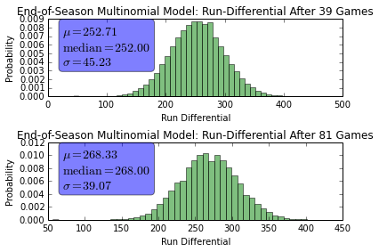

Here are the same distributions, but overlapping:

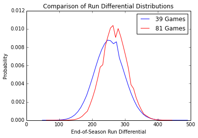

We can convert the run differential distribution into a win/loss distribution since whenever the run differential is greater than 0, the team wins and whenever the run differential is less than 0, the team loses. Thus, let $p = \sum\_{i>0} p(X = i \vert \mathcal{D})$ be the probability that the team wins, and $1-p$ be the probability that the team loses. Then we can replicate the prior analysis but rather than having a multinomial experiment, we have a [binomial](http://en.wikipedia.org/wiki/Binomial_distribution) experiment. For the end-of-season run differential, we had to compute the sum of the multinomial random variables, which is why I resorted to monte carlo. In the win/loss case, the number of wins at the end of the season is known analytically and is the binomial distribution, so monte carlo is not required. Below is the distribution of the number of wins:

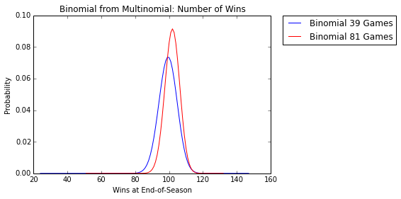

The mean number of wins under this model after the A's first 39 games is $\mu\_{39} = 99.34$ with variance $\sigma^{2}\_{39} = 29.19$ and the mean number of wins after the A's first 81 games is $\mu\_{81} = 101.87$ with variance $\sigma^{2}\_{81} = 18.92$. Note that a win/loss model could be derived directly in a similar way as the previous analysis using a binomial likelihood instead of a multinomial likelihood and a beta prior distribution rather than a Dirichlet prior.

The previous results assumed the hyperparameters $\alpha$ were equal to the empirical historical run differential distribution. From before, we know that $p(X = i \vert \mathcal{D}) = \frac{\alpha\_j + N\_j}{\sum (\alpha\_i + N\_i)}$, thus all the $\alpha\_{i}$ are probabilities so the predictive posterior will be dominated by the observed run differentials $\mathcal{D}\_{n}$. Indeed this is the case, as observed in the following plot:

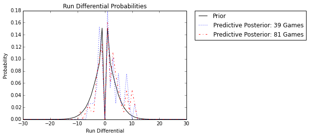

As expected, the Dirichlet prior is essentially irrelevant and the observed run differential dominates. In this case, the historical knowledge of run differential plays no role in the end-of-season analysis. In the next sections we will place different weights on the $\{\alpha\_{i}\}$ so the prior plays a greater role in the estimate of end-of-season run differential and the number of wins at the end of the season.

## Fully Weighted $\alpha$

In this section, we will take the opposite extreme, where the $\{\alpha\_{i}\}$ are the historical run differential counts. Because there are 10,000s of games, the prior will dominate and the A's run differential counts for 39 and 81 games will be insignificant. Below is the predictive posterior distribution with the new $\{\alpha\_{i}\}$ hyperparameters and as expected, the prior dominates and makes the posterior equivalent to the prior:

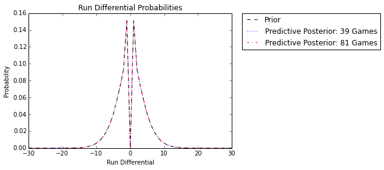

In this case, history dominates and we are not using any information from the A's current season. Below are the same plots as the previous section, but with the historically dominate prior:

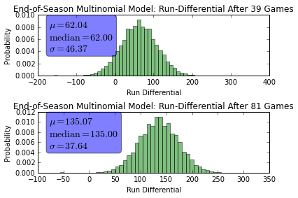

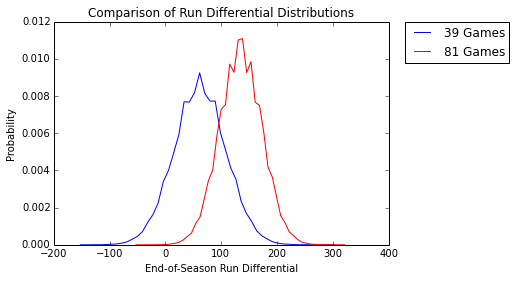

Because the past dominates, and the A's have a well above average run differential so far this year, the predictions are pessimistic. With unweighted $\alpha$, the predicted end-of-season run differential was over 250 after both 39 and 81 games. With the dominate prior, the prediction has dropped to end-of-season run differentials of 62 and 135. Below is the end of season win distribution:

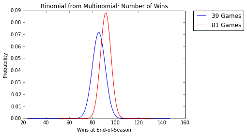

After 39 games, the expected number of wins is $\mu\_{39} = 85.50$ with variance $\sigma^{2}\_{39} = 30.75$ and after 81 games, the expected number of wins is $\mu\_{81} = 91.50$ with variance $\sigma^{2}\_{81} = 20.25$. Once again comparing this to the previous section, we see the wins prediction is very pessimistic. 

## Moderately Weighted $\alpha$

In this section, I will chose a constant $c$ to multiply the unweighted $\{ \alpha\_{i} \}$ (the historical probabilities from two section prior). For this section I will choose $c = 100$. Below are the predictive posteriors and historical prior under this weighting:

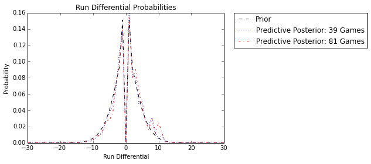

We see that this weighting, as expected, causes the posterior the be inbetween the unweighted and fully weighted posteriors from the prior sections - it is a compromise between the past historical data and the A's current season. Below are the run differential distributions using this weighting: 

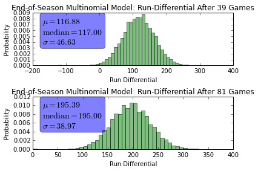

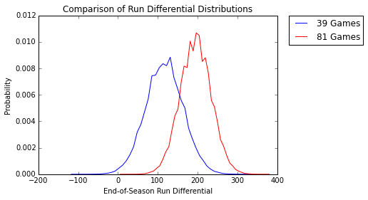

Again, notice how the mean run differential predictions lie inbetween the current season dominated predictions of the unweighted $\{\alpha\_{i}\}$ and the historically dominated predictions of the fully weighted $ \{ \alpha\_{i} \} $. This last figure is the wins distribution for this weighting:

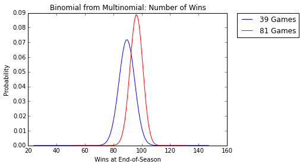

After 39 games, the expected number of wins is $\mu\_{39} = 89.48$ with variance $\sigma^{2}\_{39} = 30.62$ and after 81 games, the expected number of wins is $\mu\_{81} = 96.20$ with variance $\sigma^{2}\_{81} = 19.98$.

## Concluding Remarks

The previous analysis shows some interesting Bayesian analysis we can perform with the run differential information. The art of Bayesian analysis is justifying the choice of the prior. We looked at three different Dirichlet priors in this article. It could be possible to select the hyperprior weightings by trying to reduce the mean squared error on some test set, but that will not be persued here (due to laziness). 
